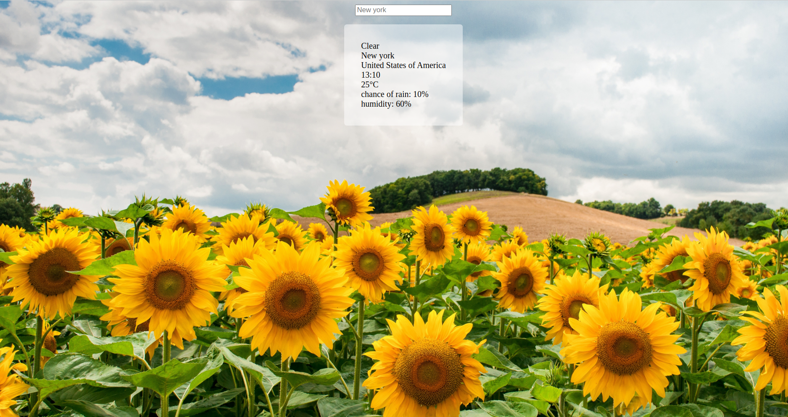

# weather-app
An app for viewing weather forecasts. This project is part of The Odin Project's full stack javaScript curriculum. 

Click [here](https://eveieve.github.io/weather-app/) for a  live preview. 

## technologies 
javaScript, CSS, HTML
# objective 
This project is built for learning. 
The objectives are to 

* utilize a public weather API for viewing weather forecasts 
* understand API keys and their basic security measures

# features 

* search for weather in a specific city 
* changes the background image according to the forecast
* toggles between showing celsius and fahrenheit
